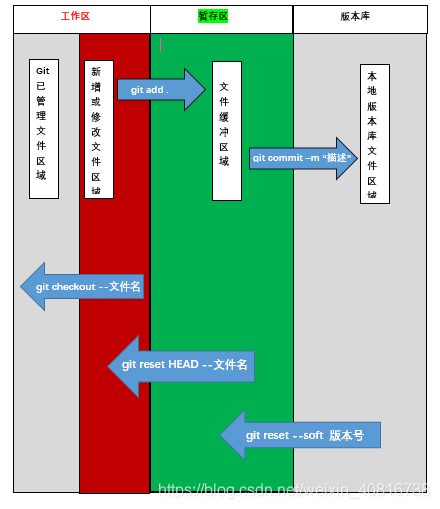

# git-基础命令学习
---

### git-基本流程

- **初始化git仓**
```shell
git init [directory]
```

- **添加配置信息(刚开始提交代码需要)**
```shell
# 邮箱
git config --global user.email "you@example.com"

# 用户名
git config --global user.name "Your Name"
```

- **向暂存区添加文件**
```shell
# 添加单个文件
git add <file_name>

# 添加所有文件
git add .
```

- **向版本库提交文件**
```shell
git commit -m '描述信息'
```

- **查看提交记录**
```shell
git log
```

### git-三大区域

- **git-三大区域图**



- **git三大区域详解**
```shell
# 1.撤销工作区的修改
git checkout -- <file_name> || git restore <file_name>

# 2.添加文件到暂存区
git add <file_name> || git add .

# 3.暂存区文件回滚到工作区
git reset HEAD -- <file_name> || git restore --staged <file_name>

# 4.暂存区文件提交到版本库
git commit -m '注释'

# 5.回滚到前一个版本
git reset --hard <版本号>

# 6.回滚到后一个版本
git reflog
git reset --hard <版本号>
```